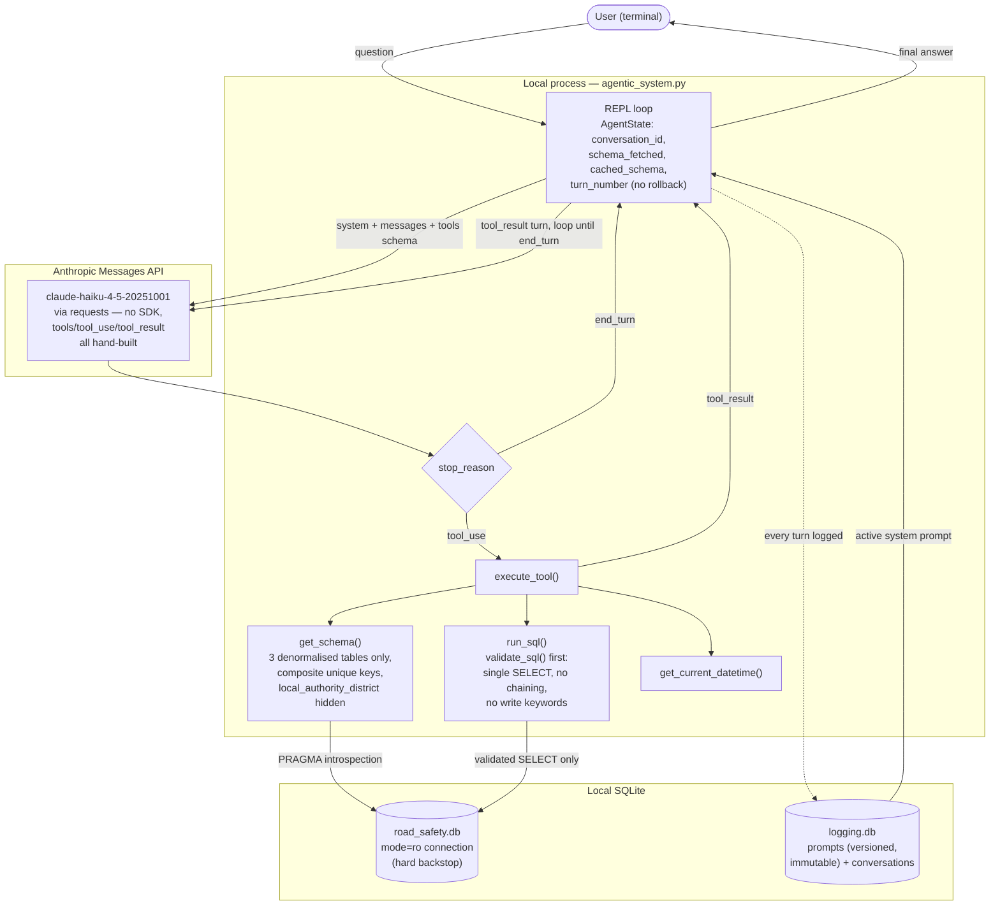

# agentic-ai — STATS19 Query Agent

A single-agent, REPL-style, read-only natural-language question-answering system over
the UK Department for Transport's STATS19 road traffic collision data. Built for AI
Masters capstone project P6. Full design rationale is in `P6_implementation_plan.md`;
the task-by-task build brief is in `P6_claude_code_brief.md`.

## What this is

- A REPL script that answers questions about UK road collisions by generating and
  running read-only SQL against a local SQLite database, via the Anthropic Messages
  API (`claude-haiku-4-5-20251001`), called directly with `requests` — no `anthropic`
  SDK. Tool-calling (schema construction, `stop_reason: tool_use` round-trips,
  `tool_result` turns) is all hand-implemented.
- The agent cannot write, update, or delete data under any circumstance, and refuses
  questions outside the collision/vehicle/casualty domain or unsupported by the data.
- Every turn of every conversation is logged to a local SQLite logging database,
  tagged with the system prompt version that produced it.

## Architecture



Two things worth calling out if this goes in the report: the `mode=ro` SQLite
connection is the actual hard guarantee against writes — `validate_sql()` is
belt-and-braces defence-in-depth, not the only thing standing between the model and a
write (see "What's code-enforced vs. prompt-engineered" further down for the full
breakdown of what's guaranteed vs. observed-so-far). The `Dispatch → Tools → REPL →
API` loop is exactly how the tool-use round-trip actually works: nothing returns to
the user until `stop_reason` is `end_turn`, which may take several tool calls within
one user turn.

## Dataset

STATS19 Road Safety Collision Data — the UK Department for Transport's official road
traffic collision database, pre-curated "last 5 years" extract (collision years
2021–2025 inclusive): <https://www.gov.uk/government/statistical-data-sets/road-safety-open-data>

Three source tables (collision, vehicle, casualty) are ingested and denormalised into
a single SQLite database, `data/road_safety.db`, by `full_ingestion.ipynb`. That
database actually contains **6 tables**: the denormalised `collision`/`vehicle`/
`casualty` tables (decoded text values — the agent's query surface) plus
`collision_normalised`/`vehicle_normalised`/`casualty_normalised` (integer-coded
counterparts, used during ingestion). The agent's `get_schema` tool only ever exposes
the 3 denormalised tables.

`data/road_safety.db` (~1.3GB) and the raw CSVs in `data/raw/` (~243MB combined) are
**not included in this repo or any submission zip** — too large. See Reproduction
below.

## What was built

| File | Purpose |
|---|---|
| `models.py` | Pydantic models for tool argument/result shape validation |
| `tools.py` | `get_schema` (3 denormalised tables only, composite unique keys surfaced, `local_authority_district` hidden — see `data_gap.ipynb`), `run_sql` (validator + read-only connection), `get_current_datetime` |
| `init_logging_db.py` | Creates the logging DB (`prompts`, `conversations` tables) |
| `seed_system_prompt.py`, `seed_system_prompt_v2.py`, `seed_system_prompt_v3.py` | Inserts and activates system prompt v1/v2/v3 in turn — each a new immutable row, `is_active` flipped, per the plan's §8 traceability design. **Run v3 last** (or just v3 alone against a fresh logging DB) to get the current behaviour; v1/v2 exist for history, not for re-running in production. |
| `agentic_system.py` | The REPL agent itself (the actual running model) |
| `test_tools.py`, `test_agentic_system.py` | pytest suite |
| `testing.ipynb` | Workbench notebook: reconstructs logged conversations from the Task 9 evaluation run, with observations, plus a later "v3 re-run" section re-running the full set after the prompt/data fixes below |
| `data_gap.ipynb` | Standalone, runnable demo of the `local_authority_district` data gap and its resolution (ingestion fix + `get_schema` exclusion + prompt v2/v3 behaviour) |
| `logging.db` | Populated logging DB from all evaluation runs (tracked in git — it's KBs, not a large-data problem) |

Docker containerisation (implementation plan §12) was **not implemented** — dropped
per a standing "no Docker in any capstone project" constraint, noted as a Future
Extension in the design report rather than attempted.

## Reproduction

1. **Get the raw STATS19 CSVs.** Download the "last 5 years" collision, vehicle, and
   casualty extracts from the DfT link above into `data/raw/` (filenames expected by
   `full_ingestion.ipynb`:
   `dft-road-casualty-statistics-{collision,vehicle,casualty}-last-5-years.csv`).
2. **Build the STATS19 database.** Run `full_ingestion.ipynb` top-to-bottom. This
   produces `data/road_safety.db` (~1.3GB, gitignored).
3. **Initialise the logging database and seed the system prompt** (skip if you want
   to keep the evaluation-run `logging.db` already in the repo):
   ```
   python init_logging_db.py
   python seed_system_prompt_v3.py
   ```
   (v3 is the current active version — see the file table above. `seed_system_prompt.py`
   and `seed_system_prompt_v2.py` insert v1/v2 for history; only run them first, before
   v3, if you want the full version history in a fresh `logging.db`.)
4. **Set your API key** — create a `.env` file in the project root:
   ```
   ANTHROPIC_API_KEY=sk-ant-...
   ```

## Running the REPL

```
python agentic_system.py
```

Type a question, get an answer; Ctrl-D to exit. Each session gets a fresh
`conversation_id` and starts with no cached schema.

## Running the tests

```
pytest -v
```

19 tests covering SQL validation (rejects non-`SELECT`, chained statements, write
keywords), the read-only connection genuinely refusing writes, connection cleanup on
both success and exception paths, schema-cache behaviour (only queried once per
session), composite unique keys surfaced by `get_schema`, and `local_authority_district`
correctly hidden from it.

## Installing dependencies

```
python -m venv .venv && source .venv/bin/activate   # or use an existing venv
pip install -r requirements.txt
```

`requirements.txt` is generated from actual imports (`pipreqs --scan-notebooks`), not
a full environment freeze — see Task 13 notes in the build brief for how it was
produced and cross-checked.

## What's code-enforced vs. prompt-engineered

Worth being explicit about, since they carry different reliability guarantees:

- **Code-enforced (hard):** the read-only SQLite connection, the SQL validator
  (single `SELECT`, no chaining, no write keywords), schema-cache-once-per-session,
  `local_authority_district` hidden from `get_schema`. These hold regardless of model
  behaviour — verified by `test_tools.py`/`test_agentic_system.py`, not just observed
  in conversation.
- **Prompt-engineered (soft):** schema-first behaviour, out-of-domain/write refusal,
  asking which column is meant on ambiguity, tie-reporting, excluding NULL from
  rankings (v2/v3). These have held in every live test run so far (see `testing.ipynb`
  and `data_gap.ipynb`), but are model behaviour, not a guarantee — a differently
  phrased question or a future model swap could behave differently. Worth naming as a
  limitation in the report, not just a solved problem.

## Known open item

The injection-attempt eval question (Task 9, Q8) was refused entirely at the
model/prompt layer — the agent never attempted a `run_sql` call, so the code-level
validator and read-only backstop were never actually exercised by that specific live
attempt (both are independently confirmed via pytest, just not through this path). A
follow-up test that gets the model to actually issue a disguised-write `run_sql` call
would close this out — flagged in `testing.ipynb`, not yet done.
